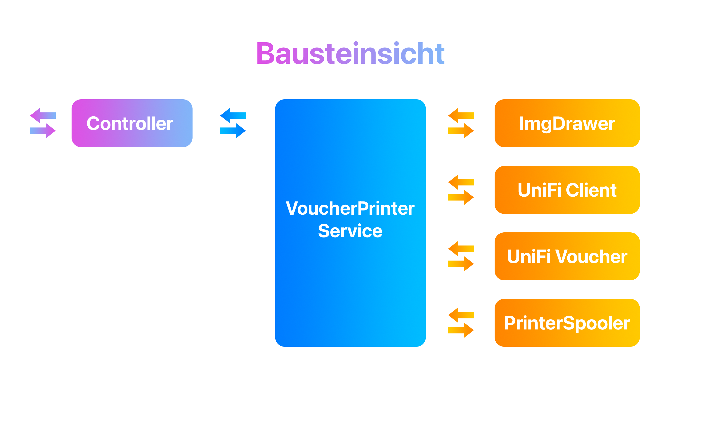
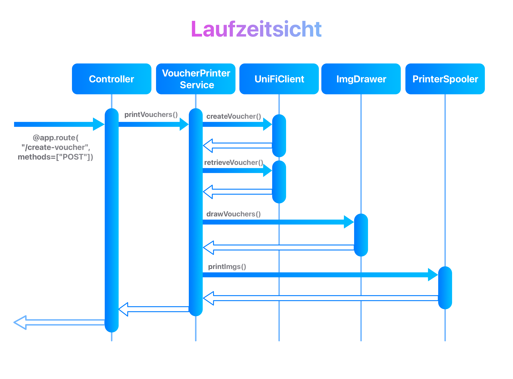

# Einführung und Ziele

Der UniFi Voucher Printer ist eine Webanwendung, die primär das
Erstellen und Drucken von Wifi Zugangscodes für ein UniFi Gäste-Netzwerk
handhabt. Die Anwendung soll einfach, intuitiv und ohne technische
Vorkenntnisse benutzt werden können. Sie wurde für das Hotel [Locanda Oca Bianca](https://www.hotelocabianca.it/) in Como (CO) Italien entwickelt.

Die Anwendung stellt eine Alternative zu dem bereits durch die UniFi OS
Konsole zur Verfügung gestellten Webinterfaces zum Erstellen von
Vouchern dar. Dieses Interface erfordert grundlegende Kenntnisse über
Netzwerke und bietet keine Möglichkeit die Voucher individual zu
gestalten.

- Die Anwendung soll Eingaben des Nutzers mittels eines responsive
  Webinterface entgegennehmen und einen Voucher mit einem standard
  Etikettendrucker ausdrucken können.

- Zu den Eingaben zählen die Zimmernummer, die Anzahl der Gäste und die
  Aufenthaltsdauer der Gäste.

- Sie soll nur innerhalb des internen Netzwerkes erreichbar sein. Die
  Anwendung soll offen für zukünftige Erweiterungen sein.

- Die Stakeholder sind die Rezeptionisten am Empfang des Hotels und der
  Entwickler Federico Nellen.

## Aufgabenstellung

### Qualitätsziele

Das System soll zuverlässig, funktional und wartbar sein. Darunter
fällt:

| Priorität | Qualitätsziel   | Begründung                                                                                                                                                                                                                                                                                                                             |
| --------- | --------------- | -------------------------------------------------------------------------------------------------------------------------------------------------------------------------------------------------------------------------------------------------------------------------------------------------------------------------------------- |
| 1         | Zuverlässigkeit | Das System erstellt bei vollständiger Eingabe der erforderlichen Daten einen Voucher. Sollte der Drucker nicht erreichbar sein, so wird er Zugangscode auf der Weboberfläche angezeigt und eine Warnung wird angezeigt. Nach Neustart des Systems soll ohne weitere Konfiguration das Drucken und Erstellen von Vouchern möglich sein. |
| 2         | Funktionalität  | Das System beschränkt sich auf die Erstellung und den Druck von Vouchern. Für den Nutzer soll dieser Prozess so einfach wie möglich gestaltet sein. Es soll keine Behinderung im Chek-In Prozess der Hotelgäste darstellen.                                                                                                            |
| 3         | Wartbarkeit     | Das System kann modifiziert werden, um es zu verbessern, korrigieren, oder an geänderte Bedürfnisse anzupassen.                                                                                                                                                                                                                        |

### Stakeholder

| Rolle      | Kontakt           | Erwartungshaltung                                                                                                 |
| ---------- | ----------------- | ----------------------------------------------------------------------------------------------------------------- |
| Nutzerin   | \*\*\*, Rezeption | Einfach zu bedienendes System, dass den Check-In Prozess nicht behindert. Keine technischen Kenntnisse Vorhanden. |
| Entwickler | Federico Nellen   | Wartbares und funktionales System, dass an neue Anforderungen angepasst werden kann.                              |

## Randbedingungen

- Das System verwendet das Python Paket
  [brother_ql](https://github.com/pklaus/brother_ql) zum Drucken der
  virtuell erstellten Voucher. Es ist primär dafür vorgesehen auf einem
  Linux Betriebssystem verwendet zu werden.

- Bei der Implementation sollen die Qualitätsziele im Vordergund.

- Pfadangaben, Aufrufe von Programmen, etc. sollen in Form von
  Linuxbefehlen geschehen

- Während der Entwicklung wird Git zur Versionskontrolle verwendet.

- Das Projekt wird auf einem lokal geghostetem GitLab Server gehostet,
  mit dem CI/CD betrieben wird.

- Als Dokumentationskonvention wird Arc42 verwendet.

## Kontextabgrenzung

Das System stellt dem Benutzer eine Weboberfläche zur Verfügung. Es
besitzt ein Frontend und ein Backend. Es findet keine Authentifizierung
statt.

Das Frontend stellt Anfragen über HTTP an das Backend. Es nimmt Eingaben
vom Nutzer entgegen.

Das Backend kommuniziert mit dem Python Packet brother_ql über
Programmaufruf mittels BASH. Dieses übernimmt die Kommunikation mit dem
Etikettendrucker über USB. Ebenfalls kommuniziert das Backend über HTTP
mit der UniFi OS Konsole, um die Gäste-Vouchercodes zu generieren.


### Fachlicher Kontext

| Nachbarsysteme     | Beschreibung                                                                                                    |
| ------------------ | --------------------------------------------------------------------------------------------------------------- |
| Nutzer             | Macht Eingaben für die Erstellung eines Vouchers. Erwartet nach Absenden der Daten einen gedruckten Voucher.    |
| Website (Frontend) | Bietet eine Schnittstelle zwischen Nutzer und Backend.                                                          |
| Backend            | Kommuniziert mit Brother_ql und dem UniFi OS. Fragt den Vouchercode an und erstellt eine Bilddatei zum drucken. |
| UniFi OS           | Zentrale Komponente des Netzwerks. Handhabt Zugangskontrolle und vergibt Vouchercodes                           |
| Brother_ql         | Python Paket zur kommunikation mit Brother Etikettendruckern.                                                   |

### Technischer Kontext

| Schnittstellen | Beschreibung                                                                               |
| -------------- | ------------------------------------------------------------------------------------------ |
| HTTP           | Die Kommunikation zwischen Nutzer, Webiste, Backend und UniFi OS Konsole erfogt über HTTP. |
| BASH           | Das Paket Brother_ql wird mittels Bash Kommando aufgerufen                                 |
| USB            | Kommunikationsprotokoll zwischen Computer und Drucker.                                     |

Es wurde sich dagegen entschieden HTTPS zu verwenden. Dies hätte sonst
einen hohen Aufwand der Zertifikatverwaltung mit sich gebracht. Das
Risiko ist gering, da die Anwendung nur innerhalb des internen Netzwerks
erreichbar ist und die Kommunikation mit der UniFi Konsole
Authentifizierung erfordert. Die Zugangsdaten autorisieren lediglich die
Verwaltung des Hotspot-Interfaces der UniFi Konsole.

## Lösungsstrategie

Mit den Qualitätszielen Wartbarkeit und Funktionalität im Vordergrund
wurde sich für ein System entschieden, das Webanfragen von Nutzern
entgegennehmen kann:

### Technologieentscheidungen

- Die einfache Bedienbarkeit der Website und die responsiveness für die
  Endgeräte hat zu der Entscheidung geführt **ReactJS** zu verwenden.
  Die komponentenweise Struktur der Website ermöglicht
  Wiederverwendbarkeit und erleichterte Wartung. Eine Änderung in der
  Grundkomponente führt zu einer Veränderung bei allen Verwendungen
  dieser.

- Als Frontendsystem wird **NextJs** verwendet. Ein leicht zu
  erweiterndes System, was die Handhabung und Konfiguration von React
  übernimmt. Es bietet viele Features, welche die Website schnell und
  effizient halten. Aus Entwicklersicht bringt es eine strukturierte Art
  der Entwicklung mit sich, die klar und einfach zu verstehen ist.

- Um eine klare Trennung der Interaktionen mit den wichtigen Komponenten
  UniFi Konsole und Drucker zu erlangen, wurde sich dafür entschieden,
  eine separate REST-Anwendung in **Python** zu erstellen. Dafür ist
  **Flask** als Framework in Frage gekommen, da es eine einfache und
  schnelle Entwicklung einer solchen Anwendung ermöglicht. In Zukunft
  kann mit diesem Framework auch Authentifikation implementiert werden.

- Im ersten Ansatz wurde das Deployment mittels Docker und
  Docker-Compose erprobt. Die nötigen Konfigurationen wurden erstellt.
  Es wurde sich schließlich dagegen entschieden, da die Anwendung auf
  einem Raspberry Pi 3 in Betrieb genommen wurde. Dieser ist in seiner
  Leistungsfähigkeit beschränkt. Zusätzlich hat die Hotplug
  Funktionalität von USB in Verbindung mit Dockercontainern
  Schwierigkeiten bereitet. In Zukunft kann dies bei einer weiteren
  Iteration der Software überarbeitet werden.  
  Letztlich laufen die Anwendungen nativ auf dem Raspberry ohne eine Art
  der Virtualisierung.

### Architekturmuster

Das Architekturmuster der Backendanwendung folgt dem MVC-Muster
(Model-View-Controller), dass eine klare Trennung der Aufgaben der
Komponenten voraussetzt. Es ist kein Domain-Driven-Design in Betracht
gezogen worden, da nach den Anforderungen keine vorhandene
Geschäftslogik bei der Erstellung von Vouchern gibt. In Zukunft kann
dies notwendig sein, sollten Anforderungen gestellt werden, welche das
Persistieren von Daten erfordert, die mit dem Hotel zu tun haben. Eine
solche Erweiterung ist mit der implementierten Architektur möglich.

### Erreichung der Qualitätsziele

Zentraler Aspekt ist die Funktionalität. Die Anwendung soll
„Narrensicher“ für die Anwender sein. Somit wurde das Fronend so
gestaltet, dass es einfach und intuitiv ist. Im Backend wurde darauf
geachtet Fehlermeldungen gezielt und präzise zu gestalten, damit eine
Ferndiagnose seitens des Entwicklers ohne große Anstrengungen möglich
ist. Kommt es zu Ausfällen seitens des Druckers, so wird dies als
Warnung wiedergegeben. Die generierten Vouchercodes werden trotzdem
angezeigt.

Die Wartbarkeit der Anwendung ist mit den Technologieentscheidungen und
Architekturmustern gegeben.

### Entscheidungen zusammen mit den Stakeholdern

Seitens der Stakeholder wurde während der Umsetzung eine neue
Anforderung gestellt in Bezug auf das Design des Vouchers und einer
Funktion auf der Website:

Das Hotel verfügt über eine Garage mit automatischem Tor. Der Code, um
dieses zu öffnen, sollte auf dem Voucher abgebildet sein. Ebenfalls
sollte es möglich sein nur diesen Code drucken zu können.

Für die erste Anforderung wurde das Design des Vouchers angepasst. Dies
erforderte eine Modifikation an dem Template, welches verwendet wird, um
das Bild des Vouchers zu erstellen. Es können nämlich nur Dateien im png
Format gedruckt werden.

Die zweite Anforderung wurde mittels einer weiteren Route in der
REST-Anwendung mit dazugehöriger Bilderstellung umgesetzt.

## Bausteinsicht



<table>
<colgroup>
<col style="width: 21%" />
<col style="width: 78%" />
</colgroup>
<thead>
<tr class="header">
<th>Baustein</th>
<th>Beschreibung</th>
</tr>
</thead>
<tbody>
<tr class="odd">
<td>Controller</td>
<td><p>Beinhaltet die API-Routen wie z.B.: „create-voucher“ und
„print-gate-code“. Nimmt Parameter der Anfragen entgegen und delegiert
die Informationen an weitere Komponenten weiter.</p>
<p>CORS Einstellungen verhindern den Zugriff von externen Websiten und
erlauben die Kommunikation mit dem Frontend.</p></td>
</tr>
<tr class="even">
<td>Voucher Printer Service</td>
<td><p>Handhabt das korrekte und aufeinanderaufbauende Aufrufen von
unterschiedlichen Komponenten:</p>
<ul>
<li><p>Das Erstellen und Abrufen der Voucher von der UniFi
Konsole,</p></li>
<li><p>Generieren der zu druckenden Bilder,</p></li>
<li><p>Inauftraggeben des Druckens der Bilder und das</p></li>
<li><p>Mitteilen an den Controller ob es zu Fehlern kam.</p></li>
</ul></td>
</tr>
<tr class="odd">
<td>UniFi Client</td>
<td><p>Enthält Funktionen, die die Verbindung zu der UniFi OS Konsole
aufbauen:</p>
<ul>
<li><p>Einloggen,</p></li>
<li><p>CSRF-Token abrufen,</p></li>
<li><p>Erstellen von Vouchern,</p></li>
<li><p>Abrufen von Vouchern,</p></li>
<li><p>Invalidierung von Vouchern</p></li>
</ul></td>
</tr>
<tr class="even">
<td>UniFi Voucher</td>
<td>Datencontainer für die Informationen enthlaten in einem Voucher</td>
</tr>
<tr class="odd">
<td>Printer Spooler</td>
<td><p>Enthält Methoden die das Kommunizieren mit dem Drucker
abstrahieren:</p>
<ul>
<li><p>Stellt fest ob das System den Drucker finden kann</p></li>
<li><p>Drucken einer Liste an UniFi Vouchern</p></li>
<li><p>Drucken des Gate-Codes</p></li>
</ul></td>
</tr>
<tr class="even">
<td>ImgDrawer</td>
<td>Erstellt mit einem gegebenen Template und den Informationen eines
UniFi Vouchers eine Bilddatei die gedruckt werden kann.</td>
</tr>
</tbody>
</table>

## Laufzeitsicht



## Verteilungssicht

Die Anwendung ist läuft auf einem Raspberry Pi 3 Model B Rev 1.2.
Aufgrund der limitierten Leistung wurde auf den Einsatz von Docker
verzichtet. Der Etikettendrucker ist mittels eines USB-Kabels mit dem
Raspberry verbunden. Der Raspberry ist mittels Ethernet an das Netzwerk
angeschlossen.

Die Anwendungen wurden als Services registriert und werden beim
Hochfahren des Systems gestartet:

[lob-backend.service](raspberry_setup/lob-backend.service)

```{.bash}
[Unit]
Description=LOB Backend Voucher System
After=multi-user.target

[Service]
Type=idle
ExecStart=/usr/bin/python /home/fnellen/Unify-Hotspot-Manager/backend/server.py
WorkingDirectory=/home/fnellen/Unify-Hotspot-Manager/backend
Environment=USERNAME=
Environment=PASSWORD=
Environment=SSID=
Environment=BUS=
Environment=DEVICE_MODEL=
Environment=DEVICE_PORT=
Environment=IMG_SIZE=
Environment=GATEWAY_IP=
Environment=GATEWAY_PORT=
Environment=FLASK_APP=
Environment=FLASK_RUN_PORT=
Environment=GATE_CODE=
Environment="PATH=/home/***/.local/bin:/usr/local/sbin:/usr/local/bin:/usr/sbin:/usr/bin"
User=***

[Install]
WantedBy=multi-user.target
```

[lob-frontend.service](raspberry_setup/lob-frontend.service)

```{.bash}
[Unit]
Description=LOB Frontend Voucher Service
After=network.target
[Service]
WorkingDirectory=/home/***/Unify-Hotspot-Manager/frontend
ExecStart=/usr/bin/npm start
Restart=on-failure
User=***
Environment=PORT=3000
[Install]
WantedBy=multi-user.target
```

### Konfiguration der Anwendung

#### Backend

Zur Konfiguration der Anwendung wird eine Datei mit dem Namen „.env“ im Ordner „backend“ angelegt. Die Datei enthält die folgenden Variablen:

```{.bash}
Environment=USERNAME="username"
Environment=PASSWORD="password"
Environment=SSID="ssid"
Environment=BUS="pyusb"
Environment=DEVICE_MODEL="QL-570"
Environment=DEVICE_PORT="usb://0x04f9:0x2028"
Environment=IMG_SIZE="62x29"
Environment=GATEWAY_IP="unifi"
Environment=GATEWAY_PORT="433"
Environment=FLASK_APP="uniFiVoucherSystem"
Environment=FLASK_RUN_PORT="5000"
Environment=GATE_CODE=""
```

Hierbei sind Username und Password die Anmeldedaten für die UniFi OS Konsole. SSID ist der Name des WLANs, das mit dem Voucher verbunden werden soll. BUS, DEVICE_MODEL und DEVICE_PORT sind die Informationen für den Drucker. IMG_SIZE ist die Größe der zu druckenden Bilder. GATEWAY_IP und GATEWAY_PORT sind die Informationen für den Controller. FLASK_APP ist der Name der Anwendung. FLASK_RUN_PORT ist der Port auf dem der Controller lauscht. GATE_CODE ist der Gate-Code, der auf dem Etikett gedruckt werden soll.

#### Frontend

Zur Konfiguration der Anwendung wird eine Datei mit dem Namen „.env.local“ im Ordner „frontend“ angelegt. Die Datei enthält die folgenden Variablen:

```{.bash}
PRINTER_SERVER="http://localhost:5000"
```

## Glossar

| Begriff     | Definition                                                                                           |
| ----------- | ---------------------------------------------------------------------------------------------------- |
| _minutes_   | _Minuten, die der Voucher nach Aktivierung gültig ist_                                               |
| _Count_     | _Anzahl der zu erstellenden Voucher, default ist 1_                                                  |
| _Quota_     | _Anzahl der erlaubten Verwendungen des Vouchers: „0“ multi-use, „1“ single-use, „n“ multi-use n Mal_ |
| _Note_      | _Beschreibung für die Verwendung des Vouchers_                                                       |
| _Up_        | _Upload Geschwindigkeitslimit in kbps_                                                               |
| _Down_      | _Download Geschwindigkeit in kbps_                                                                   |
| _Megabytes_ | _Datenvolumen in MB_                                                                                 |

## Quellen

[1] [UniFi Controller API client class](https://github.com/Art-of-WiFi/UniFi-API-client)

[2] [UniFi API Documentation](https://ubntwiki.com/products/software/unifi-controller/api)

[3] [Brother-QL](https://github.com/pklaus/brother_ql)
